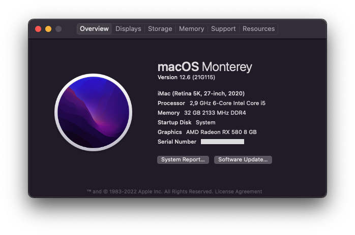

# OpenCore Gigabyte B460M Aorus Pro

OpenCore configurations for Gigabyte B460M Aorus Pro.

- Intel Core i5-10400
- Sapphire Pulse RX 580 8GB
- 4x8GB Corsair Vengeance LPX DDR4 2666MHz
- Samsung 970 EVO NVMe M.2 250GB
- Corsair Force MP300 NVMe M.2 120GB (Windows Boot)

> `EFI/Microsoft` directory is optional, it is a Windows multiboot on different drive.

## Configuration

Minimal configuration is applied for every release, this means:

- `RELEASE` version of [OpenCorePkg](https://github.com/acidanthera/OpenCorePkg/releases/) and all kexts.
- Latest [OcBinaryData](https://github.com/acidanthera/OcBinaryData/),
required for `HfsPlus.efi` and [setting up GUI](https://dortania.github.io/OpenCore-Post-Install/cosmetic/gui.html#setting-up-opencores-gui).
- Prebuilt SSDTs from [Dortania](https://github.com/dortania/Getting-Started-With-ACPI/tree/master/extra-files/compiled/).

### config.plist

Aside from the vanilla configuration of [Desktop Comet Lake config.plist](https://dortania.github.io/OpenCore-Install-Guide/config.plist/comet-lake.html),
there is small changes to `config.plist`.

| Key | Value | Note |
| --- | --- | --- |
| DeviceProperties > Add > PciRoot(0x0)/Pci(0x2,0x0) > AAPL,ig-platform-id | 0300C89B | iGPU doesn't drive display because dedicated GPU is present. |
| Kernel > Quirks > AppleXcpmCfgLock | False | `CFG-Lock` is disabled in BIOS. |
| Kernel > Quirks > DisableIoMapper | True | `VT-D` is enabled in BIOS. |
| Kernel > Quirks > XhciPortLimit | False | Running macOS 11.3+. |

### BIOS Settings

Below are the settings found in Advanced Mode of BIOS version `F6`.

| Name | Disable | Enable | Note |
| --- | :---: | :---: | --- |
| Tweaker > Advanced CPU Settings > Hyper-Threading Technology | | &check; | `Auto` also works. |
| Tweaker > Advanced CPU Settings > VT-d | | &check; | Related to `DisableIoMapper`. |
| Settings > IO Ports > Above 4G Decoding | | &check; | |
| Settings > IO Ports > Super IO Configuration > Serial Port | &check; | | |
| Settings > IO Ports > USB Configuration > XHCI Hand-off | | &check; | |
| Settings > IO Ports > SATA and RST Configuration > SATA Mode Selection | | &check; | |
| Settings > Miscellaneous > Intel Platform Trust | &check; | | |
| Settings > Miscellaneous > SGX | &check; | | |
| Boot > CFG Lock | &check; | | Related to `AppleXcpmCfgLock`. |
| Boot > Fast Boot | &check; | | |
| Boot > Windows 10 Features > Windows 10 | | &check; | `Other OS` also works. |
| Boot > CSM Support | &check; | | |
| Boot > Secure Boot > Secure Boot Enable | &check; | | |

The rest of settings that are not found:
- Parallel Port
- Thunderbolt
- VT-x
- Execute Disable Bit
- DVMT Pre-Allocated (iGPU Memory)

## Updating

Use `download_latest.sh` to gathers all the necessary files for new updates.
