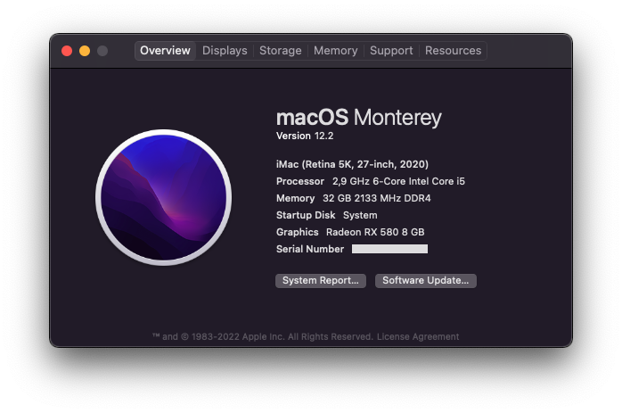

OpenCore Gigabyte B460M Aorus Pro
=================================

OpenCore configurations for Gigabyte B460M Aorus Pro.
* Intel Core i5-10400
* Sapphire Pulse RX 580 8GB
* 4x8GB Corsair Vengeance LPX DDR4 2666MHz
* Samsung 970 EVO NVMe M.2 250GB
* Corsair Force MP300 NVMe M.2 120GB (Windows Boot)

Note
----

Minimal configuration is applied for every release. This means:
* `RELEASE` version of [OpenCorePkg](https://github.com/acidanthera/OpenCorePkg/releases) and all kexts.
* Latest [OcBinaryData](https://github.com/acidanthera/OcBinaryData), required for `HfsPlus.efi` and [setting up GUI](https://dortania.github.io/OpenCore-Post-Install/cosmetic/gui.html#setting-up-opencores-gui).
* Prebuilt SSDTs from [Dortania](https://github.com/dortania/Getting-Started-With-ACPI/tree/master/extra-files/compiled).
* Only configure what's recommended for [Desktop Comet Lake config.plist](https://dortania.github.io/OpenCore-Install-Guide/config.plist/comet-lake.html).

`EFI/Microsoft` directory is optional, it is a Windows multiboot on different drive.

There is also `download_latest.command` that gathers all the necessary files for new updates.
Run `chmod +x download_latest.command` to double-click it, or by terminal.